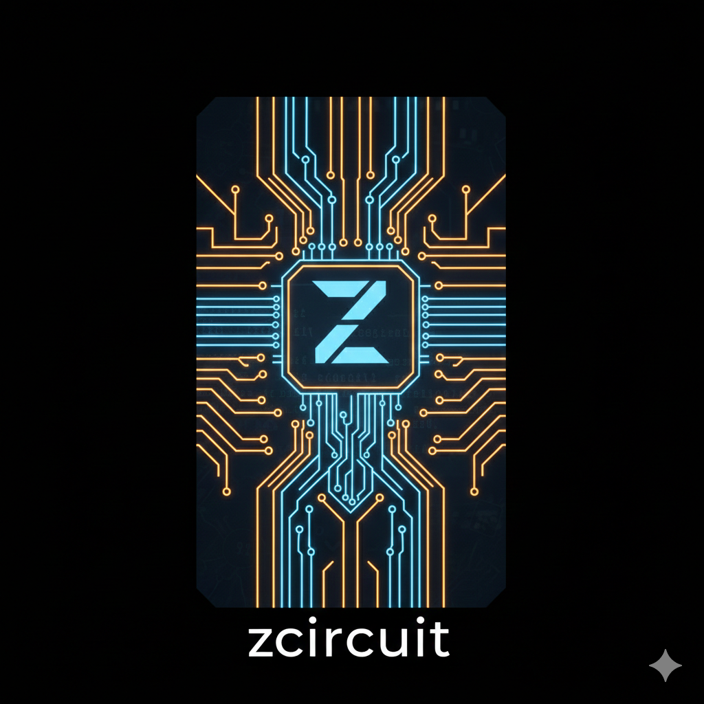

<p align="center">
  
</p>

# zcircuit

Short-circuiting the Windows API for direct syscall execution.

This is a Zig library designed for direct syscall execution by dynamically resolving System Service Numbers (SSNs) and executing syscalls through legitimate memory instructions.

[Read the technical deep dive on the implementation here.](https://hiroki6.dev/posts/direct-system-call-in-zig/)

# Features

- **Hell's Gate**: Dynamic SSN resolution by parsing DLL Export Address Table.
- **TartarusGate**: Neighboring syscall analysis to recover SSNs when a target function is hooked.
- **Hell's Hall**: Indirect syscall execution by searching for clean syscall; ret gadgets in DLL memory to bypass instruction-level monitoring.
- **Comptime Stealth**: CRC32 Hashing for both function names and module names at compile-time with a user-configurable seed. No sensitive strings remain in the binary.
- **Dynamic Module Loading**: Find and load any Windows DLL by name (ntdll.dll, kernel32.dll, etc.) with hash-based obfuscation.

# Quick Start

## Installation

Add `zcircuit` to your `build.zig.zon`:

```bash
zig fetch --save git+https://github.com/Hiroki6/zcircuit
```

Then in your `build.zig`:

```zig
const zcircuit = b.dependency("zcircuit", .{});
exe.root_module.addImport("zcircuit", zcircuit.module("zcircuit"));
```

## Example Usage

### One-Shot API (Recommended)

```zig
const std = @import("std");
const zc = @import("zcircuit");

pub fn main() !void {
    // Initialize with custom seed for compile-time string hashing
    // Specify the DLL to load (ntdll.dll, kernel32.dll, etc.)
    const MyCircuit = zc.Zcircuit(.{ .seed = 0xABCD1234 });
    var circuit = try MyCircuit.init("ntdll.dll");

    // Execute syscall directly in one line
    const status = circuit.syscall("NtAllocateVirtualMemory", .{
        process_handle,
        &base_addr,
        0,
        &size,
        0x3000, // MEM_COMMIT | MEM_RESERVE
        0x04,   // PAGE_READWRITE
    });

    if (status == std.os.windows.NTSTATUS.SUCCESS) {
        std.debug.print("[+] Memory allocated at: 0x{x}\n", .{base_addr});
    }
}
```

### Two-Step API (Advanced)

Use this when you need more control or want to reuse the same syscall:

```zig
// Resolve syscall by name with custom options
const nt_allocate = circuit.getSyscall("NtAllocateVirtualMemory", .{
    .search_neighbor = true,   // Enable TartarusGate
    .indirect_syscall = true,  // Enable Hell's Hall
}) orelse return;

// Call multiple times without re-resolving
const status1 = nt_allocate.call(.{...});
const status2 = nt_allocate.call(.{...});
```

For a complete example, see the [example](./example/) directory.

```powershell
> inject_shellcode.exe
[+] Resolved NtAllocateVirtualMemory -> SSN: 0x18, Base: 0x7FFE4410D9A2
[+] Memory allocated at: 0x26afad10000
[+] Resolved NtProtectVirtualMemory -> SSN: 0x50, Base: 0x7FFE4410E0A2
[+] Memory protected!
[+] Resolved NtCreateThreadEx -> SSN: 0xC2, Base: 0x7FFE4410EED2
[+] Thread created!
[+] Resolved NtWaitForSingleObject -> SSN: 0x04, Base: 0x7FFE4410D722
```

# Credits & Inspiration
This project is a Zig implementation and refinement of several pioneering research techniques.

- [Hell's Gate](https://github.com/am0nsec/HellsGate): The original technique for dynamic SSN extraction.
- [TartarusGate](https://github.com/trickster0/TartarusGate): Improved SSN recovery via neighboring stubs.
- [Hell's Hall](https://github.com/Maldev-Academy/HellHall): Indirect syscall instruction searching.
- [Bananaphone](https://github.com/C-Sto/BananaPhone): A major inspiration for the API design.

# Legal Disclaimer

This tool is for educational purposes and authorized security auditing only. The author is not responsible for any misuse of this software.
